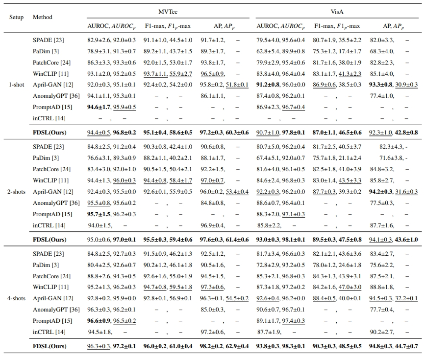

# FDSL(Feature Discrepancy guided Score Learning for few-Shot anomaly detection)

> [2025]

## Abstract

Few-shot anomaly detection aims to identify and locate image anomalies using limited normal samples, enabling rapid deployment in industrial and safety applications. However, recent multimodal pre-trained methods often rely on statistical comparisons between query and reference features, which may lead to overlapping anomaly scores due to neglecting normal region interference and local contextual correlations. To address this, we propose the Feature Discrepancy guided Score Learning (FDSL) method. FDSL explicitly models deviations from normal patterns via a Feature Discrepancy (FD) module that separates patch features into normal and deviation components. An Anomaly Score Learning (ASL) module is then introduced to capture feature correlations and integrate neighboring patch information for more discriminative scores. Additionally, a Local-enhanced Feature Extraction (LFE) mechanism improves detection of small-area anomalies, while an image feature index memory bank reduces redundancy to optimize memory usage. Experimental results on MVTec and VisA datasets show that FDSL achieves state-of-the-art performance in 1-shot, 2-shot, and 4-shot segmentation tasks and is competitive in classification, demonstrating its effectiveness and adaptability in few-sample scenarios.

## OverView of FDSL

 

Overview of FDSL. The framework consists of three core modules: the Feature Discrepancy (FD) module, the Anomaly Score Learning (ASL) module, and the Local-enhanced Feature Extraction (LFE) mechanism. During training, the FD module creates differential feature maps from intermediate features, which the ASL module refines into anomaly score maps using ground truth for optimization. During testing, the LFE mechanism improves detection of small area anomalies, and the outputs from both FD and ASL are merged to form the final anomaly score map.

## How to Run

### download datasets

MVTec: [click here](https://www.mvtec.com/company/research/datasets/mvtec-ad)

VisA: [click here](https://github.com/amazon-science/spot-diff)

### generate dataset JSON file

Taking the **MVTec** dataset as an example, generate the `meta.json` file.

Run the `mvtec.py` file provided in the `data` folder to generate the corresponding `meta.json` file.

~~~bash
cd data
python mvtec.py
~~~

Structure of **MVTec** Folder:

~~~
mvtec/
│
├── meta.json
│
├── bottle/
│   ├── ground_truth/
│   │   ├── broken_large/
│   │   │   └── 000_mask.png
|   |   |   └── ...
│   │   └── ...
│   └── test/
│       ├── broken_large/
│       │   └── 000.png
|       |   └── ...
│       └── ...
│   
└── ...
~~~

Apply the same approach to the **VisA** dataset.

### Run FDSL

#### train and test

Quick train and test

run `trainAndTest.sh` , if `winmode=nan` means don't use **LFE**, `winmode=mul ` means use **LFE**

The parameters' meaning:

> model_name: 			your model name for train/test results
>
> device: 						cpu, cuda number
>
> useNAM:					use "Neighbor Aggregation Module" ?
>
> winmode:					option: nan, mul, onlywin
>
> win-size:					default: 13
>
> win-stride:				default: 2
>
> win-weight:				default: 0.5
>
> seed:							random seed
>
> kshots:						k-shots: 1, 2, 4

~~~bash
bash trainAndTest.sh {model_name} {device} {useNAM} {winmode} {win-size} {win-stride} {win-weight} {seed} {kshots}
~~~

for example:

**FDSL** with **NAM** and **LFE**

~~~bash
bash trainAndTest.sh fdsl 0 1 mul 13 2 0.5 14 1
~~~

**FDSL** with **NAM** and without **LFE**

~~~bash
bash trainAndTest.sh fdsl 0 1 nan 13 2 0.5 14 1
~~~

**FDSL** without **NAM** and without **LFE**:

~~~bash
bash trainAndTest.sh fdsl 0 0 nan 13 2 0.5 14 1
~~~

#### only test

~~~bash
bash test_few_shot.sh {model_name} {device} {useNAM} {winmode} {win-size} {win-stride} {win-weight} {seed} {kshots}
~~~

## Main Results

 

## Visualization
 

## Acknowledgements

We thank for the code repository: [open_clip](https://github.com/mlfoundations/open_clip), [VAND](https://github.com/ByChelsea/VAND-APRIL-GAN/tree/master), [AnomalyCLIP](https://github.com/zqhang/AnomalyCLIP),  and [WinCLIP](https://github.com/zqhang/Accurate-WinCLIP-pytorch).

